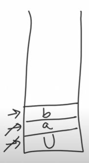

# Making the string Great again

## problem statement 

When given a string `s = "UabBCcAs"` with both upper and lower case characters. 
We need to make it "Great". It is "Great" when it **doesnt contain** two adjacent and SAME characters `s[i]` & `s[i+1]`, such that `s[i]` is a lower case letter and `s[i+1]` is in uppercase and vice-versa.


`Caa`, `CAA` are great.<br>
`caA`, `CaA` are not great<br>
`abCcdD` not great.

Remove the bad characters and repeat until the string is good.
*Notice* an empty string is also good.

## Example

Using `s = "UabBCcAs` as an example. When we iterate the string, the first instance of adjacent characters we get are `bB`. Since they are not great, we remove them. Next, it is `Cc`. Similarly we also remove them. Now we are left with `UaAs`. Since we now have `aA`, we will have to remove them, leaving us with `Us` and hence making the string great.

## What Data structure is used

For this question, we are using a `Stack`. Why? We are iterating over the string and pushing our values as long as our string `s` is valid. When we encounter a value that is not valid, we pop it. Repeat until the string is great. 


## Visual Explanation
From the image below, we pushed the values `U`, `a` and `b` into the stack as they all satisfy the condition so far, but once the next value, `B` is evaluated, we find that it violates the condition. Hence `B` is not added, and `b` is removed from the stack.The top of the stack falls back to `a`.

This concept repeats until the string satisfies the condition. 



Up until here, the condition is satisfied until the next input, which is `B` the loop will check if it satisfies the condition, if it does not, it will remove it from the stack. 

```
stack.pop();
```
If it satisfies the condition, it will then add it to the stack.
```
stack.push(stack_name)
```
## Solution

So for the first part, we declare a stack named `container`
```
std::stack<char> container;
```
We then loop through the string `s` and check if it is empty, and if the adjacent characters satisfies the condition.

```
//loop 
for(auto current : s)

//check for empty stack and condition

if(!container.empty() && (current - container.top())==32);
{
	container.pop(); // remove if failed.
}
```
Now, when we are dealing with alphabets, we are using their ASCII value. `A` and `a` have a difference of 32 in their values and so on and so forth. 


```
else{
container.push(current);
}
```
This loop will ensure our String input is "Great".

Now to return our new string, we have to populate a temp string value with it.

### Declare a new string and initiate with the size of the stack

```
int n = container.size();
int i = n-1; 

//we populate a string of size n with temporary characters '.'
std::string ans(n, '.')

```
>filler constructor used here. 

## Populate the new temp string with our final "Great" string.

We loop the stack using a while loop. <br>

We set the string at i to be the latest stack using : <br>
```
ans[i] = container.top()
```

Then we remove it from the stack after adding it to the new String `ans` and decrement it. 
```
container.pop();
i--;
```
It will look something like this

```
while(!container.empty()){

ans[i]=container.top();
container.pop();
i--
}

return ans;
```


## Time and Space Complexity 

Given the total length of the string as N, and we are iterating over the string, then the time Complexity will be O(n). 

```
for(auto current :s) //O(n)
```
Iterating over N elements in the string
# If we receive a "Great" string. `"aaaaaaaaaaaaaa"`. Then the first check will be ignore and only the while loop is executed. As we are also iterating over a string of size N, its time complexity will also be O(n). `O(n) + O(n) = O(2n)`. Since we ignore the coefficient, Time complexity will be O(n).

The Space complexity will be O(n). 
As we are iterating over the stack, the best case will be `aaaaaaaaa` hence we only need iterate over the string. 


